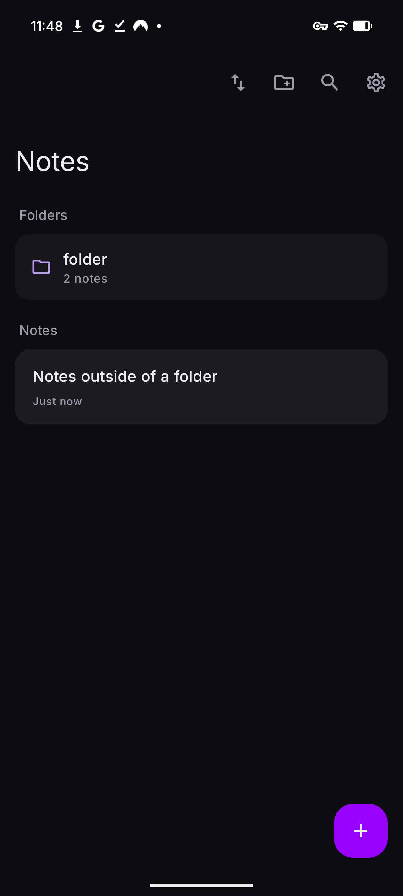
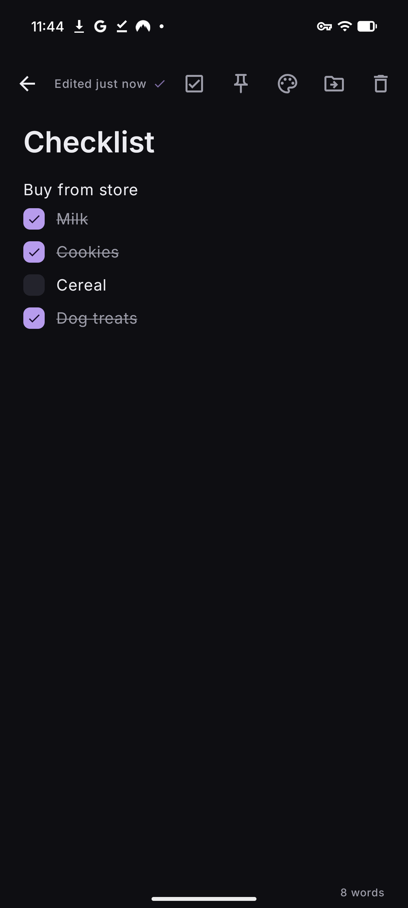
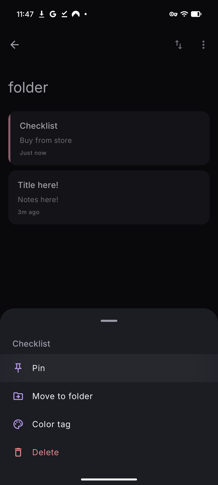

<p align="center">
  
</p>

# Elendheim Notes

A note app that keeps its mouth shut. Everything you write stays on your phone; the app has no network permission, so your notes cannot leave the device even in theory. No accounts, no sync, no analytics, no ads.

<p align="center">
  
  
  
</p>

## How it works

Tap the plus button and start writing. There is no save button; the app saves as you type and shows a small tick when your words are on disk. Back out of a note you never typed in and it quietly removes itself.

Type `-` at the start of a line and it turns into a checkbox. Checked items get a line through them and stick around, and once you have checked off every last one, the finished list clears itself. A shopping list that cleans up after the shopping.

Long-press anything for its actions: pin a note to the top, move it into a folder, give it a color stripe, or delete it. Swiping a note away deletes it too, with an undo in case your thumb was faster than your brain. Folders keep things grouped, and deleting a folder sends its notes back to the main list instead of taking them down with it.

In settings you can export every note and folder to a single file, and import it again on any phone. That file is your backup; keep it wherever you trust. You can also lock the app, or individual folders, behind your fingerprint. Locked folders stay out of search results and off the widget.

Speaking of which: there is a home screen widget. When you add it, you pick what it shows, whether that is one specific note or your pinned ones, and it has a plus for starting a new note without opening the app first.

## Installing

Grab the APK from the [latest release](../../releases/latest) and install it on any Android 8.0+ phone.

## Building

Open the project in Android Studio, or from the command line:

```
./gradlew assembleRelease
```

The APK lands in `app/build/outputs/apk/release/`. Every push also builds an APK on GitHub Actions, and running the Build workflow with a version number publishes a release.

The signing key in `signing/` is intentionally public so anyone can build the exact same APK. It is a sideload distribution key, not an app store identity.

## License

[MIT](LICENSE)
