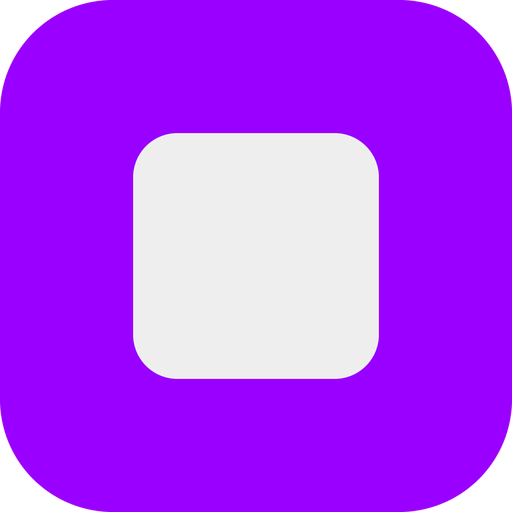

<p align="center">
  
</p>

# Elendheim Notes

A simple, private note app for Android. Notes are stored on your phone and nowhere else.

## What it does

- Write notes with a title and a body. Everything autosaves as you type, with a quiet tick when your words hit the disk.
- Type `- ` to start a checklist. Checked items get a line through them, and a fully finished list clears itself.
- Group notes into folders, pin the ones you keep coming back to, and give notes a color stripe for visual grouping.
- Search across every note, and sort each list by last edited, newest, or A to Z.
- Swipe a note away to delete it, with undo. Deleting a folder returns its notes to the main list.
- Back up every note and folder to a single file you keep wherever you want, and import it on any phone.
- Lock the whole app or individual folders behind your fingerprint or screen lock, if you choose to in settings.
- Put a widget on your home screen showing whichever note you pick, or your pinned notes, with a one-tap new note button.

## What it does not do

- No accounts, no sync, no cloud.
- No network permission at all. The app cannot send your notes anywhere, even if it wanted to.
- No analytics, no tracking, no ads.

## Design

Dark interface with a soft purple accent. Built with Jetpack Compose and Material 3, storage handled by Room (SQLite). Works on Android 8.0 (API 26) and up.

## Installing

Grab the APK from the [latest release](../../releases/latest) and install it on any Android 8.0+ phone.

## Building

Open the project in Android Studio, or from the command line:

```
./gradlew assembleRelease
```

The APK lands in `app/build/outputs/apk/release/`. Every push also builds an APK on GitHub Actions, and version tags publish a release automatically.

The signing key in `signing/` is intentionally public so anyone can build the exact same APK. It is a sideload distribution key, not an app store identity.

## License

[MIT](LICENSE)
